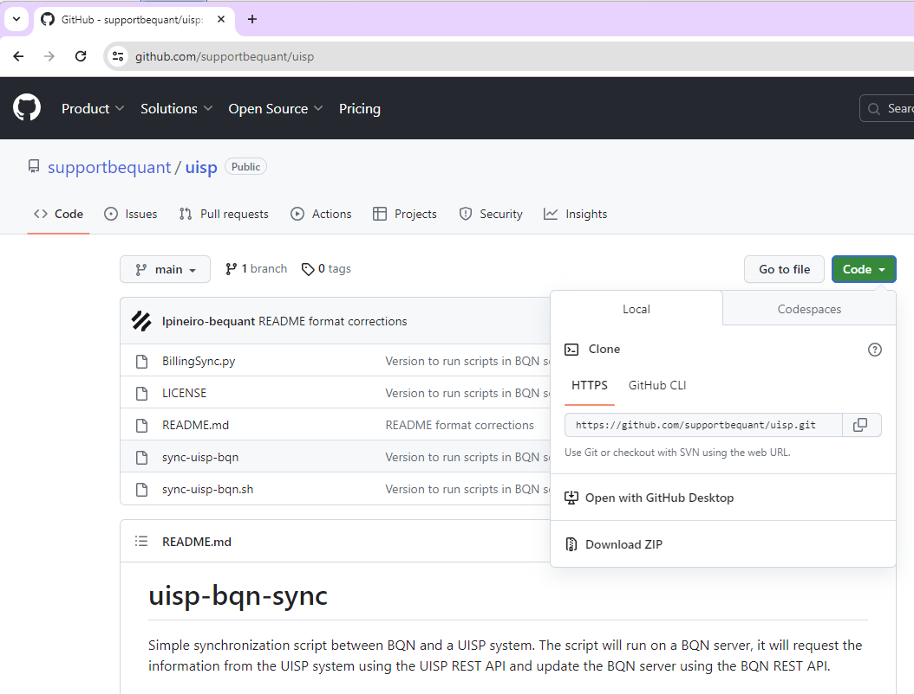

# uisp-bqn-sync

Simple synchronization script between BQN and a UISP system. The script
will run on a BQN server, it will request the information from the UISP system
using the UISP REST API and update the BQN server using the BQN REST API.

## Installation

### Prerequisites

1. BQN with packages linux-R3.0.13-2-20231130 or later and bqn-R4.18.8 or later.

2. BQN with REST API enabled (see https://www.bequant.com/docs/rest#rest-configuration).

3. UISP with REST API enabled with access to both NMS and CRM. A common API KEY 
for both types of access must be created.


### Steps

1. Go to code [repository](https://github.com/supportbequant/uisp) and get the code zip file (in repository home page, go to Code->Download ZIP).


2. Unzip the code zip file. For example with unzip command:
```
unzip uisp-main.zip
```
This will create a subdirectory named uisp-main.

2. Create a uisp directory in the BQN server root account:
```
ssh root@<BQN-OAM-IP>
mkdir uisp
exit
```
Where \<BQN-OAM-IP\> is the managemement IP address of the BQN server

3. Edit the sync-uisp-bqn.sh to set the parameters to your environment values.
Example:
```
. . .
# BQN management IP address
BQN_OAM_IP=192.168.0.121
# Name of the REST user in the BQN server
BQN_REST_USER=myuser
# Password of the REST user in the BQN server
BQN_REST_PW=mypassword
# IP address or domain of the UISP server
UISP_SERVER=myserver.uisp.com
# REST API KEY of the UISP server
UISP_KEY=5a15d248-376b-1324-cd15-24ad3a37be31
. . .
```

4. Transfer the following files from the PC to the BQN server using scp:
```
scp ./uisp-main/BillingSync.py  ./uisp-main/sync-uisp-bqn ./uisp-main/sync-uisp-bqn.sh root@<BQN-OAM-IP>:uisp
```

5. In the BQN, copy sync-uisp-bqn.sh to the crontab directory so it is executed every 5 minutes:
```
ssh root@<BQN-OAM-IP>
cp uisp/sync-uisp-bqn.sh /bqn/root/etc/cron.5
``` 

And that's all, the script will access the UISP every 5 minutes and update the BQN accordingly.
You can check the script log in the BQN:

```
ssh root@<BQN-OAM-IP>
less /tmp/sync-uisp-bqn.log
Synchronization at 2024-01-03 18:40:02.059393 with script v1.5
Synchronization at 2024-01-03 18:40:19.251052 of 26 policies and 649 subscribers
```

To see the policies and subscribers createe in the BQN server, see the section
"Check the REST API" in https://www.bequant.com/docs/rest#rest-configuration


## Updates

To update the synchronization script, do the following:

1. Go to code (repository)[https://github.com/supportbequant/uisp] and get the code zip file (in repository home page, go to Code->Download ZIP).

2. Unzip the code zip file. For example with unzip command:
```
unzip uisp-main.zip
```
This will create a subdirectory named uisp-main.

3. Transfer the following files from the PC to the BQN server using scp:
```
scp ./uisp-main/BillingSync.py  ./uisp-main/sync-uisp-bqn root@<BQN-OAM-IP>:uisp
```
Where \<BQN-OAM-IP\> is the managemement IP address of the BQN server. NOTE 
that the sync-uisp-bqn.sh MUST NOT be updated.
 
## Known limitations

- The first time it may take minutes to run. Following executions will send to BQN only client changes and will be quicker.
- If the synchronization fails, no retry is attempted (must be done externally).

